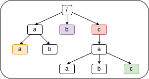

# USO - Repaso 2

### Indicaciones útiles:

- El comando `cat` puede tomar varios argumentos de entrada con lo que se genera una salida con el contenido
  de los ficheros especificados en orden.
- Como sabemos el comando `cat` utiliza la entrada estándar cuando no se especifica entrada. La manera de hacer esto
  explícitamente es utilizar `-` como argumento.
- La orden `id` muestra información sobre el usuario actual y los groupos a los que pertenece en el siguiente formato:

  `
  uid=[id de usuario]([nombre de usuario]) gid=[id de grupo principal](nombre de grupo principal) groups=[otros grupos]
  `
  
  El grupo principal es el grupo al que pertenecen los ficheros creados por el usuario.

- El comando `true` no produce ninguna salida ni toma ninguna entrada o argumento y siempre termina exitosamente.
  Igualmente el comando `false` siempre termina con error.

### Ejercicios

1. Crear un fichero `resultados` con aquellas líneas del fichero `filtrar_datos` que cumplan

    - La linea comienza por 'A' (mayúscula o minúscula)
    - La linea termina en 3 dígitos
    - La linea se encuentra entre las últimas 30

    Y después el contenido íntegro de todos los ficheros que comiencen por _datos_.

2. Tenemos un directorio `/home/secretario/agenda` con estos ficheros entre otros:
    - `Albacete`
    - `Almería`
    - ...

    Que contienen información con la siguiente estructura

    `[Apellido1]    [Apellido2] [Nombre]    [Telefono]`

    Te sitúas en el directorio `/home/secretario`, muestra un mensaje informativo que indique
    el número de contactos de provincias que comienzan por la letra __S__ cuyo teléfono termine por __6__,
    por ejemplo:

    `Existen 10 contactos en provincias que comienzan por S cuyo teléfono termina por 6`

3. Dada la siguiente estructura de directorios

    

    - Orden para cambiar de directorio desde el directorio verde hasta el amarillo utilizando una ruta relativa y utilizando una ruta absoluta.
    - Orden para cambiar de directorio desde el directorio morado hasta el rojo utilizando una ruta relativa y utilizando una ruta absoluta.
    - Te sitúas en el nodo morado. ¿Existe algún directorio al que hagamos referencia usando la siguiente expresión? Explica por qué o por qué no.

      `
      .././a/./b/../../c/a/??
      `

4. La salida del comando `id` es la siguiente

    `uid=100(jaimito) gid=100(dept-informatica) groups=100(dept-informatica),200(alumnos)`
  
    La salida del comando `ls -l` es la siguiente

    `-rw-r--r-- 2 fulanito alumnos 4096 Dec  3 21:49 horarios`

    - ¿Qué tres dígitos representan los permisos de este fichero?
    - ¿Podría haberse creado este fichero directamente con estos permisos?
      Si es así, ¿cómo?, en caso contrario ¿Por que?
    - ¿Podrías ejecutar el comando `cat > test`? ¿Por qué? En caso de que no se pueda
      que comando utilizarías para solucionarlo?

5. Escribe la salida de los siguientes comandos:

    - `` echo `true || echo "Correcto"  > fichero && echo "Incorrecto"` ``
    - `` (false || echo "Incorrecto")  > fichero && echo "$Correcto" ``
    - `` echo '$Incorrecto' | cat ``
    - `` (echo "1" ; true || false || echo "2") && echo "3" ``

6. La salida del comando `ps` es la siguiente:

      ```
    PID TTY          TIME CMD
   4348 pts/0    00:00:00 bash
   4356 pts/0    00:00:00 ps
    ```

    Explica lo que sucede al utilizar el comando `kill -SIGKILL 4348`.